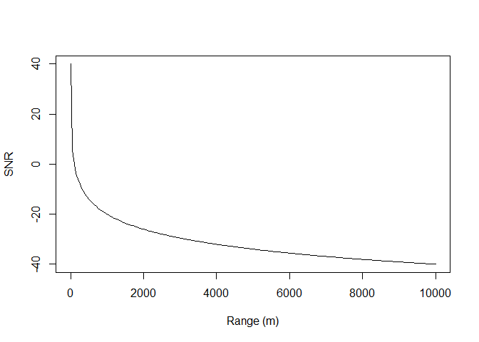
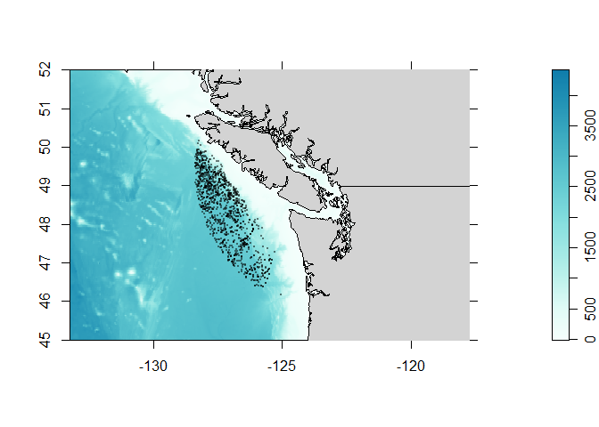
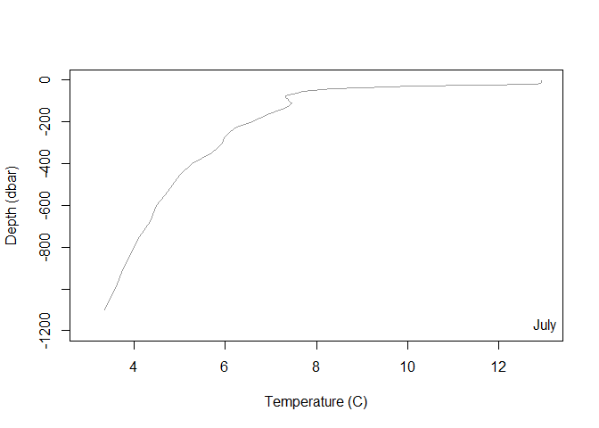
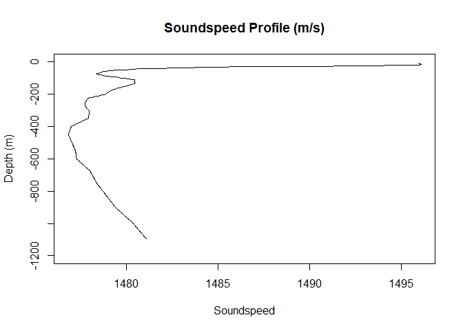
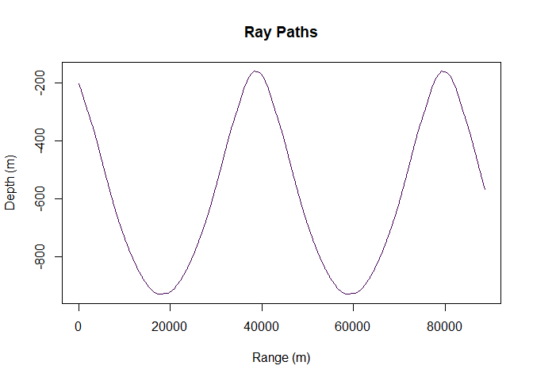
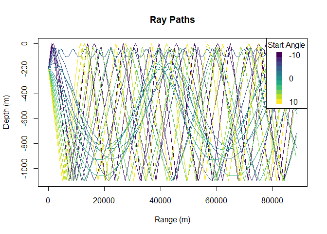
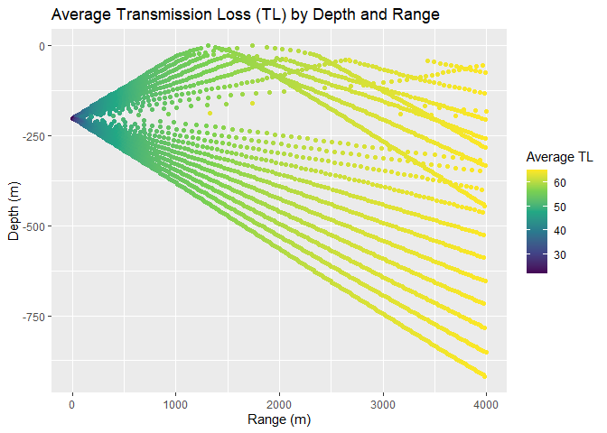
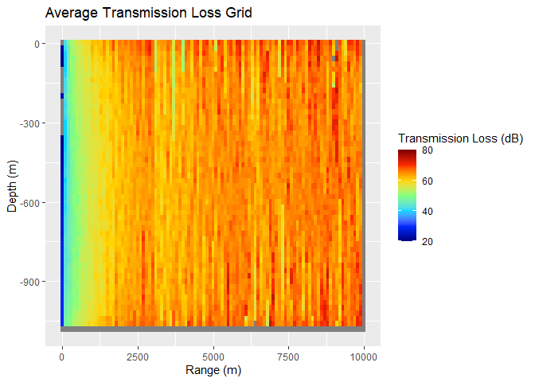

Oceanography Lab
================
2024-04-01

This tutorial illustrates some very basic principles of how sound moves through a medium with a varying soundspeed profile
This is based on previous lectures and labs in the SFU course that extracted temperature, salinity, and pressure from Argos data. 

The methods implemented here are highly simplified and not suitable for research. However, they do demonstrate some of the concepts decently well.
Please use and cite appropriately especially noting the raytrace_TL function which was modified by the author but is based on pervious works whcih are documented in the comments. 

## Sounds Good. Listening in the Ocean.

In the lecture we discussed some of the reasons utilizing sound to study
the ocean is beneficial. In the underwater environment, sound travels
much further than light which is dispersed, absorbed, and defracted by
suspended particles. Sound, on the other hand, is much more efficient in
travelling through water. As such, many species from clams to beaked
whales have evolved to use sound in the marine environment.

In this lab we will build on the Argo data lab by exploring how sound
moves in the marine environment. We will download Argo data, extract the
the temperature, salinity, and depth and use these to create a
soundspeed profile. We will then use ray-tracing models to look at the
sound propagation through the water column. Finally, we will simulate a
sound source (e.g. whale, ship, shrimp, sub) and estimate how far that
sound could be detected.

## Workspace Setup

The first step with any analysis is to set up our libraries, paths,
functions, and variables. It’s generally good practice to clear your
work space before you start. We do this with the rm(list =ls()) command.

``` r
rm(list=ls())
library(argoFloats) # Load and manipulate the argos data
library(ocedata) # Required to plot argos data
library(ggplot2) # tidy package for plotting
library(scales) # also scales
library(viridisLite) # for colorblined friendly color scales
```

These are the packages we will use. Because the analysis gets a little
intense I’ve also written functions for calculating and plotting the
transmission. We will load these as well as the Argo data from last
time. **You will need to change the path to for the r script and the
Argo data to wherever you have them stored locally.**

``` r
# Load the custom functions to process soundspeeds
source("~/GitHub/SFUGuestLecture/TL function.R")

# Load the argos data
load("~/GitHub/SFUGuestLecture/indexAll.RData")
```

## How Far Can You Hear It?

As we discussed in the lecture, we know that sounds must received above
a certain signal-to-noise ratio (**SNR**) to be detected. Most simply,
SNR is defined as how loud the thing you are interested in (**Source
Level; SL**) minus the background noise at the sensor (NL) and how much
energy the sound signal lost covering the space between the source and
receiver. This is referred to as **Transmission** or **Propagation**
**Loss (TL)**.

SNR= SL-TL-NL

All values are in decibels and *must* be measured over the same
frequency range with the same reference pressure. In this lab we are
going to play with this function to first estimate our detection radius
and then were are going to take a dive into propagation modelling with
the Argo data you worked with last time.

In an unrestricted environment sound will attenuate with spherical or
cylindrical spreading. Imagine all the sound energy in your source at an
initial time. As with surface waves on a pond, they spread away from the
source location and the height (amplitude) of the wave decreases with
time as the diameter of the wave increases. Thus the transmission loss
can be simplified to TL= 20\* log10(r) where r is the range from source
in meters

``` r
# Lets simulate the the amplitude of a wave as it spreads linearly from the source location (x = 0) to some other point (x=r)


# The transmission loss at 1 meter 1 km and 10kms using spherical spreading
20*log10(1)
```

    ## [1] 0

``` r
20*log10(1000)
```

    ## [1] 60

``` r
20*log10(10000)
```

    ## [1] 80

We can now calculate the SNR as a function of range. Lets assume a
source (e.g. whale) produces a sound at 120 dB re 1uPa and the
background sound level is comprised of wind and wave noise at an average
of 80 dB re 1uPa

``` r
# Range in meters
r = seq(1,10000, length.out =200)
SL = 120 #how loud the whale or ship or explosion is
NL = 80 # how loud the background noise is

# Signal to noise ratio
SNR = SL-20*log10(r)-NL

# Plot it!
plot(r, SNR, xlab = 'Range (m)', ylab = 'SNR',  type='l')
```

<!-- -->

At what range does the SNR drop below 0 db?

## Loading the Argo Data

As the last lab, we need to select one or many of the Argo float
datasets to work with. Here we will just work with the July data.

``` r
# Plot all of the ARGOS float locations
plot(argosClean, which="map", bathymetry=TRUE,
     xlim=c(-129,-122), ylim=c(45,52),
     col=rgb(0,0,0,.5), cex=0.3, pch=16)
```

<!-- -->

This should look familiar! Now lets select one of the floats from July
(where there is a thermocline).

``` r
argosID = argosClean[['ID']]
index2 = subset(argosClean, ID="4901570") # select one track ID

pressureJul = index2[['argos']][[1]][['pressure']]
temperatureJul = index2[['argos']][[1]][['temperature']]
salJul = index2[['argos']][[1]][['salinity']]


# plot July profile
plot(temperatureJul, -pressureJul, ylim=rev(c(0,-1200)),
     xlim=c(3,13),
     xlab='Temperature (C)', ylab='Depth (dbar)',
     pch=16, col=rgb(0,0,0,.4),
     type='l')
legend('bottomright', legend='July',bty='n')
```

<!-- -->

## Sound Speed Profile From Argo Data

You previously learned that Argo data contain temperature, salinity, and
depth information. Incidentally, these are the values we need to
calculate the sound speed. We will use the Mackenzie 1981 equation to
convert these variables to a sound speed for each depth step. Together
this is called a sound speed profile.

As with a temperature profile, which looks at the how temperature
changes with depth we can begin to understand how sound travels in the
ocean by creating a soundspeed profile. While this is less relevant to
marine life, it does impact how sound travels in the environment as
sound bends and refracts when it encounters different specific acoustic
impedance values (rho \*c).

In the next section of code uses the Argo data to create a soundspeed
profile.

``` r
# Functions to create a smooth temp/salintiy gradient at arbitrary depths.
salJulfx = approxfun(pressureJul, salJul)
tempJulfx = approxfun(pressureJul, temperatureJul)


# Set up the soundspeed profile, we want to estimate it for the entire depth at uniform intervals. This isn't required but it keeps things neat.
depth <- seq(0, 1200, by =3)
temp <- tempJulfx(depth)
sal <- salJulfx(depth)

# Use the salinity and temperature to calculate the soundspeed at each depth
ssp <-soundSpeedMackenzie(D = depth, S = sal, Temp = temp)

# Plot the soundspeed profile
plot(ssp, -depth, xlab = 'Soundspeed',
     ylab = 'Depth (m)',
     main ='Soundspeed Profile (m/s)', type ='l')
```

<!-- -->

You can see that the soundspeed profile changes by about 15m/s from the
top of the ocean down to 1200m. This, in some cases, can cause a
tunneling effect in which sound gets ‘trapped’ in channels. For a good
example of this, Google the SOFAR channel 🧠💥.

## Ray Tracing (Single and Multiple Rays)

Ray tracing in \[underwater\] acoustics is a way of mapping how sound
moves. We intuitively know that sound is reflected by a change of
density (i.e. echos). In the ocean sound bounces off the surface and
bottom as it travels away from the source.

The path of travel can be represented using single lines. By doing this,
scientists can figure out how sound spreads underwater and how it
interacts with things like the ocean floor and underwater objects. This
helps us understand underwater communication, detect submarines, and
study marine life. Here we will use ray tracing to look at the path of
sound produced at a certain angle.

``` r
# The Argos float only goes down so deep (hitting the bottom with an expensive bit of kit is ill advised). So lets populate the rest of the SSP with the value of the last observed soundspeed. This isn't perfect but it's a reasonable approximation

# Clear out SSP values with NA
depth= depth[!is.na(ssp)]; ssp=ssp[!is.na(ssp)]

# Set up a sound source (e.g. dolphin, snapping shrimp etc.) and we are going to pretend that the sound it produces travels in only one direction (theta). That sound will bounce off the surface and bottom moving away from the source.

#Start distance for the source, leave at 0
sourceDist = 0

# Sound source depth in meters
sourceDepth = 200 

# Angle at which the sound is directed
theta0 = 2

# For how long should we measure the sound (seconds)
tt = 60

#xxx tweak to not plot ssp
rt<-raytrace_TL(x0=sourceDist, z0= sourceDepth, 
                theta0, tt,  zz = depth, cc = ssp, plot=TRUE, progress = FALSE)
```

<!-- -->

If we look above, in a 2d space we can see that there are regions where
the sound hits and regions where it misses. In reality though, very few
sources are truly directional. So lets plot lots of rays with angles
between -10 and 10 deg. Additionally, the above plot shows how sound
bounces but it does not show how sound attenuates with distance (imagine
trying to hear someone at 5 meters away vs 500). So lets run the code
again with 1) multiple rays and 2) exacting the transmission loss (TL)
from the output.

<!-- -->

In the above figure you can see that, depending on the angle at which
the sound is directed it can fail to get above the thermocline. This
doesn’t mean that no sound can be heard if the source is below the
thermocline but it may reduce the amplitude at the arrival location. If
you were looking to find submarines that are known to travel mostly at
200m where should and shouldn’t you put your hydrophone in order to
increase your chances of hearing it.

## Transmission Loss

In the above section we looked at how sound travels and before that we
considered transmission loss. Moving forward we will consider both of
them together. The following plot shows the transmission loss at various
locations from the source

``` r
# Plot the transmission loss of all of the data
 min_length <- min(lengths(data$x), lengths(data$z), lengths(data$TL))

 # Truncate x, z, and TL vectors to the minimum length
 x <- unlist(lapply(data$x, head, n = min_length))
 z <- unlist(lapply(data$z, head, n = min_length))
 TL <- unlist(lapply(data$TL, head, n = min_length))


 # Create a new datafram out of our rt list and limit the range to only plot
 # from r = 0 to r = 4000
 dfout= data.frame(x=x, z =z, TL=TL)
 dfout= subset(dfout, x<4000)

 # Plot using ggplot and geom_point with color gradient
 ggplot(dfout, aes(x = x, y = -z, color = TL)) +
   geom_point() +
   scale_color_viridis_c()+  # Adjust color scale as needed
   labs(x = "Range (m)", y = "Depth (m)", color = "Average TL") +
   ggtitle("Average Transmission Loss (TL) by Depth and Range")
```

<!-- -->

Here we can see that the transmission loss increases with range so that,
regardless of the angle the we do lose energy with the distance the
sound has traveled. You can also see that in some regions sound arriving
from multiple directions intersects. This can sometimes relate to
constructive or destructive interference.

## Single Rays to Propagation Grid

Up until this point we have been considering different rays which are
like lasers in the night (insidently lasers are used in archetectural
acoustics to figure out where sound travels and how much to charge for
the cheap seats). But to estimate the transmission loss for an omni
directional source (think lamp instead) we can average over multiple
angles. The code below will take multiple source angles and average them
over a grid that we set up. Don’t worry about the warnings

``` r
# Example usage with user-defined parameters

#sourceDepth <- 20  # Source depth in meters (as before)

theta_range <- seq(-90, 90, by = 2)  # Range of angles for multiple rays
tt <- 60  # Total travel time

# Set up the intended output grid for the transmission loss
range_extent <- 10000  # Range extent in meters (e.g., 10 km)
depth_extent <- max(depth)  # Depth extent in meters
range_resolution <- 100  # Range resolution in meters (e.g., 100m)
depth_resolution <- 20  # Depth resolution in meters (e.g., 10m)

# Run the transmission loss model, this will take a little while
result_grid <- compute_avg_TL_grid(sourceDist, 
                                   sourceDepth, 
                                   theta_range, tt, depth, ssp,
                                   range_extent, depth_extent,
                                   range_resolution, depth_resolution,
                                   progress = FALSE,
                                   plot = TRUE)


# Plot the result
p<- plotTLgrid(result_grid)
p
```

<!-- -->

## Fun Stuff (for some…)

Some fun acoustics links

Animations of the principals of acoustics -
<https://www.acs.psu.edu/drussell/Demos/Reflect-Particles/Reflect-Particles.html>

All things sound in the sea- <https://dosits.org/>

What’s your favorite animal sound from this website?
